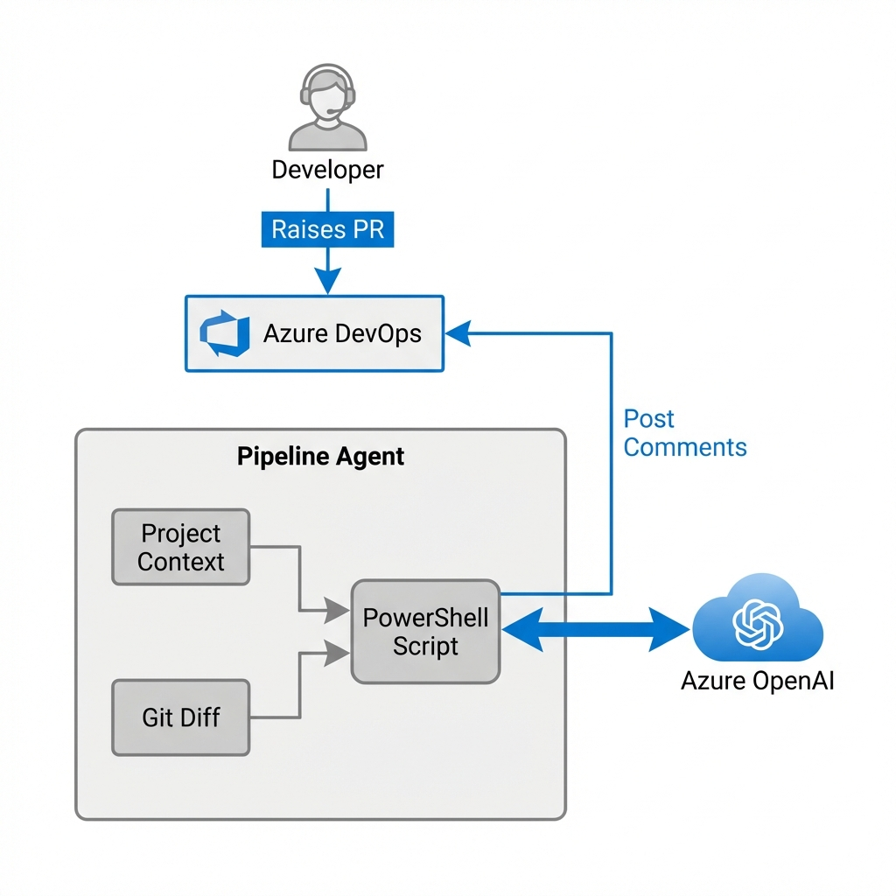

# 🏏 AI-Powered PR Reviewer for Azure DevOps

## 📋 Summary
An automated Pull Request review system integrated directly into **Azure DevOps pipelines** using **PowerShell**, leveraging **Azure OpenAI** to provide intelligent implementation feedback and code quality checks.

---

## 🚩 Problem
Manual code reviews are essential but face significant challenges:
*   **Time Consuming:** Delays in feedback loops slow down the entire development cycle.
*   **Human Fatigue:** Reviewers miss subtle bugs or style violations after long hours.
*   **Context Switching:** Architectural standards documented in markdown files are frequently overlooked.
*   **Inconsistency:** Different reviewers apply different standards.

## 💡 Solution
We introduce a **"Direct Pipeline"** integration:
*   **Runtime:** A lightweight PowerShell script running within the PR validation build.
*   **Context Aware:** Automatically reads `project_context.md` to understand *your* specific architectural rules.
*   **Smart Analysis:** Identifies changes via `git diff` and queries Azure OpenAI with a tailored prompt.
*   **Automated Feedback:** Posts constructive comments directly to the Azure DevOps PR threads.

---

## 🏗️ High Level Architecture

1.  **Trigger:** 👤 Developer raises a Pull Request in Azure DevOps.
2.  **Pipeline:** 🚀 The PR Build Pipeline triggers (YAML).
3.  **Checkout:** 📥 Agent checks out source code & documentation.
4.  **Analysis:** 🧠 PowerShell script reads context & diffs.
5.  **AI:** 🤖 Payload sent to Azure OpenAI API.
6.  **Loop:** 💬 Comments posted back to PR via ADO REST API.

---

## 🚀 Business Benefits

| Benefit | Impact |
| :--- | :--- |
| **Speed** | ⚡ **~30% faster** approval cycles via instant feedback. |
| **Quality** | 🛡️ **Consistent** application of architectural standards. |
| **Cost** | 💰 **Low Cost** - uses existing pipeline minutes, no extra Azure resources. |
| **Context** | 📚 **Smarter than Linting** - understands documentation intent. |
